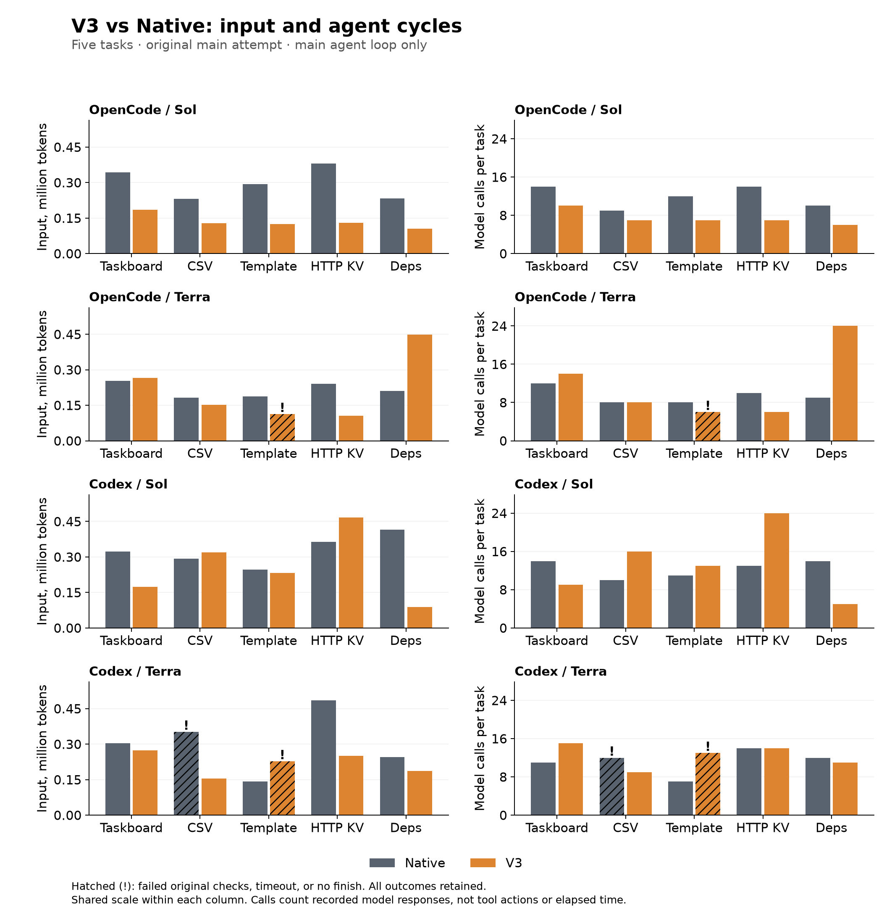
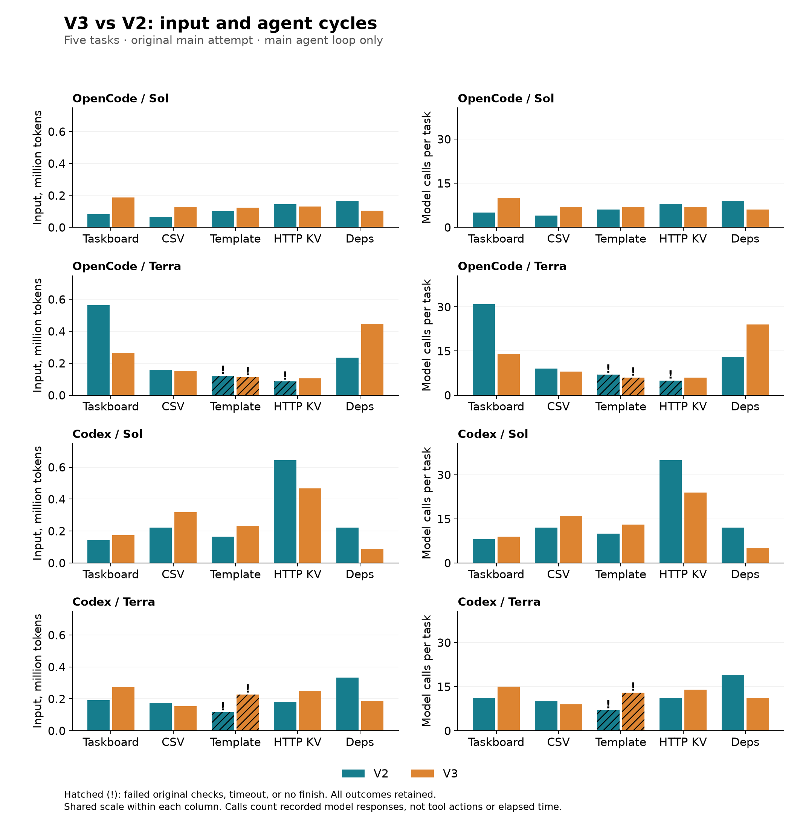
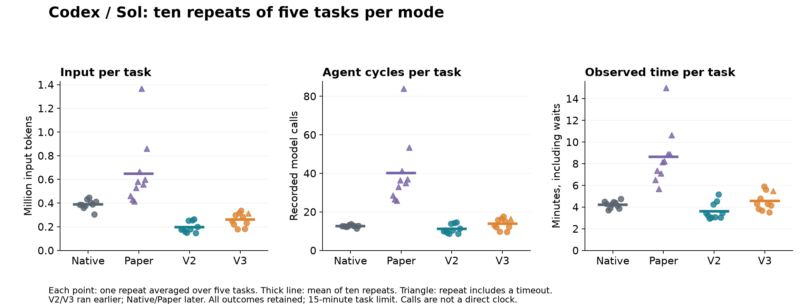
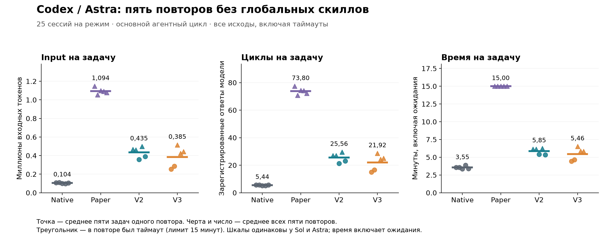
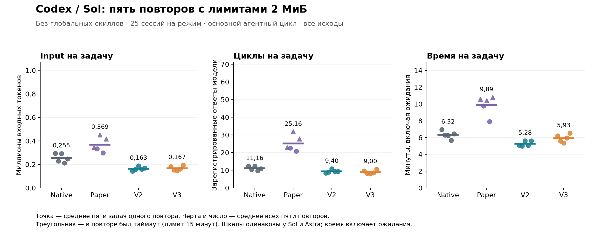
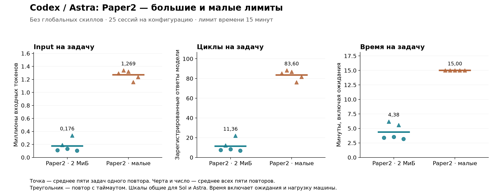

# SKILL.state в coding-агентах: меньше истории, но не всегда меньше работы

## О чём этот текст

Это рассказ о моём эксперименте: что захотелось попробовать, что получилось и где пришлось
пересмотреть свои ожидания. Я не ставлю здесь задачу кого-то обучить или доказать, как правильно
устраивать память агентов. Просто захотелось поделиться этим опытом — вместе с результатами,
ошибками и вопросами, на которые у меня пока нет ответа.

## С чего всё началось

Недавно мне попалась статья [SKILL.state: Scalable Long-Horizon Agent Skills](https://arxiv.org/abs/2608.26263),
и её идея меня зацепила: что, если агенту не нужна вся история работы и размышлений, чтобы выбрать
следующее действие? Вместо неё можно хранить явное состояние выполнения и собирать очередной запрос
вокруг него.

Раньше я работал с похожей архитектурой: смесью машины состояний и LLM workflow, где отдельные узлы —
полноценные агенты со своим циклом работы, agent loop. Но каждый из них решал довольно узкий класс задач.
Перенести тот же принцип на агента, который самостоятельно пишет код, мне тогда не приходило в голову.
Поэтому захотелось попробовать идею «во плоти».

Итак, я решил перенести общую идею SKILL.state на задачи самостоятельной разработки
программных проектов. В качестве основы взял два опенсорсных coding-агента — OpenCode и Codex:
хотелось посмотреть, насколько результат зависит от устройства самого агента.
Мне было интересно, как такая память поведёт себя внутри привычного рабочего цикла: агент получает
спецификацию, создаёт файлы, запускает проверки, исправляет ошибки и решает, когда работа закончена.
Сразу оговорюсь: это не повторение авторских экспериментов, а попытка применить их концепцию в другом окружении.

Сначала я адаптировал протокол и перенёс его в ядра обоих агентов, чтобы следующий запрос собирался
из состояния, а не из накопленной истории. Затем, посмотрев на первые запуски, решил немного доработать подход с опорой
на собственный опыт: добавить память о недавних действиях, а позже — возможность выполнять несколько
действий между обращениями к модели. Так появились варианты, которые дальше я называю V2 и V3.

По дороге пришлось разбираться и с поведением моделей, и с ошибками собственной реализации, а некоторые
поначалу обнадёживающие результаты на повторных запусках уже не выглядели так убедительно.
Об этом и будет рассказ — пока об инженерном опыте с открытым кодом и журналами, из которого
хочется вырастить исследовательскую работу.

## Что предложили авторы оригинальной статьи

SKILL.state предлагает организовать работу агента так, чтобы контекст не разрастался с каждым шагом.
Авторы рассматривают длительные задачи, в которых агент рассуждает, вызывает инструменты
и взаимодействует со средой — проще говоря, делает работу. Разработка ПО упоминается как одна из областей применения,
но сама архитектура не привязана к coding-агентам. [Постановка задачи в статье](https://arxiv.org/html/2608.26263v2#S1).

В привычном агентном цикле к исходной задаче постепенно добавляются рассуждения, команды, ответы инструментов,
затем новые рассуждения. Если история накапливается без сжатия, а шаги добавляют примерно одинаковый объём,
контекст растёт линейно. Но отправляем мы его заново на каждом шаге, поэтому суммарный расход входных
токенов растёт уже квадратично. SKILL.state предлагает вместо всей этой истории собирать запрос из трёх частей:

```text
P неизменная постановка задачи
Σₙ текущее структурированное состояние
Oₙ последнее наблюдение среды
```

В ответ модель должна вернуть изменение состояния — patch — и следующее действие. Исполняющая часть агента,
то есть runtime, проверяет и применяет этот patch, выполняет действие и возвращает наблюдение среды.
На следующем шаге предыдущие рассуждения и старые ответы инструментов в запрос уже не попадают:
если что-то из них пригодится позже, модель должна сама сохранить это в состоянии.

Мне нравится именно такое разделение ответственности. Программа следит за структурой состояния и исполняет
команды, а модель решает, что стоит помнить. От её выбора зависит, с какой информацией агент
продолжит работу и что ему придётся запрашивать заново.

Правда, у этой экономии есть условие: всё необходимое для продолжения работы должно помещаться
в ограниченное состояние и наблюдение. Только тогда объём входа на шаг перестаёт расти вместе
с историей. Если важная деталь потеряется, агенту придётся восстанавливать её, а это дополнительные
шаги. При написании кода их может набраться столько, что короткие запросы уже не окупятся.
Именно с этим я столкнулся в первых опытах.

Экспериментальная часть оригинальной статьи охватывает несколько разных сред. В ней есть синтетический
склад, симуляция репозитория с ветками, PR и статусами CI, терминальные задачи InterCode CTF и обслуживание
клиентов в τ-Bench. Симуляция репозитория проверяет управление связанным состоянием, а CTF — поиск флагов
через команды и проверку гипотез. Это смежные с разработкой сценарии, но всё-таки не то же самое, что
самостоятельное создание приложения по спецификации. [Описание бенчмарков](https://arxiv.org/html/2608.26263v2#S4).

У авторов в синтетическом эксперименте с управлением складом на горизонте 200 шагов получилось примерно
122 тысячи токенов у SKILL.state против 2,61 млн у ReAct
([таблица 1](https://arxiv.org/html/2608.26263v2)). Разница впечатляет, но переносить её на агента,
который пишет код, заранее было бы слишком смело. Захотелось посмотреть, сколько от этой экономии
останется на наших задачах и сможет ли агент с такой памятью довести разработку до конца.

## Как я проверял идею

Начал я с плагина для OpenCode, но довольно быстро упёрся в ограничение: плагин требовал от модели дополнительных
действий для работы с памятью и не мог гарантировать, что на каждом шаге она выдаст patch вместе с действием.
Получался другой эксперимент, поэтому механизм пришлось перенести в ядро.

В ядровой реализации задача и состояние сразу включены в запрос: модели не нужно отдельно читать файл памяти.
История при этом никуда не исчезает из журналов — она нужна для разбора запусков, — но обратно модели
в state-режимах не отправляется. Рабочая папка тоже сохраняется, так что созданные файлы агент может перечитать
обычными инструментами. Если интересно посмотреть код, начать можно со
[сборщика состояния OpenCode](../opencode/packages/opencode/src/session/skill-state.ts) или
[ядра состояния Codex](../codex/codex-rs/core/src/skill_state.rs).

Ранние пробы, в том числе с GLM-5.2 и Luna, остались [в общем журнале](../journals/README.md).
Для статьи я начал с отдельного сравнения на OpenCode и Codex, а затем продолжил эксперименты
на Codex: добавил повторы, убрал глобальные скиллы и проверил расширенные лимиты памяти.
В итоге получилось несколько серий. Ниже сначала опишу, что у них общего, а затем — чем они различаются.

Для эксперимента я взял пять небольших проектов:

- [CLI-менеджер задач](../experiments/skill-state/projects/taskboard-cli/SPEC.md) с сохранением данных в JSON;
- [утилиту анализа CSV](../experiments/skill-state/projects/csv-insights/SPEC.md);
- [небольшой шаблонизатор](../experiments/skill-state/projects/mini-template/SPEC.md);
- [HTTP key-value сервис](../experiments/skill-state/projects/http-kv/SPEC.md);
- [планировщик зависимостей](../experiments/skill-state/projects/dependency-planner/SPEC.md).

На каждый запуск агент получает полную спецификацию и пустую рабочую папку, после чего работает самостоятельно.
Получившийся проект проверяет внешний [оценщик](../experiments/skill-state/scripts/evaluate.ts).
Его код не добавлялся в контекст и лежал за пределами рабочей папки агента — хотя это само по себе
ещё не запрещает прочитать файл. В одном из ранних запусков я даже поймал модель на попытке
подглядеть в оценщик. После уточнения рабочей директории такое больше не повторялось,
но полноценной изоляцией эту меру, конечно, не назовёшь.

В сумме получается 40 проверок на пять проектов. Это важно не путать с 40 независимыми задачами:
например, одна ошибка сохранения базы может потянуть за собой несколько проваленных проверок.
Полный балл означает, что проект прошёл наши тесты. Ошибки за их пределами вполне могли остаться.
Да и качество кода в широком смысле мы здесь не оцениваем: проверяем, делает ли программа то, что от неё требуется.

В основных сериях сравниваются четыре режима; в конце к ним добавился ещё один контроль — Paper2.
V2/V3 и Paper2 — рабочие названия моих вариантов, они не имеют отношения к названиям версий оригинальной статьи:

| Режим | Что модель видит из прошлой работы | Что предлагает за обращение |
|---|---|---|
| Native | Штатную историю агента | Штатные tool calls / Code Mode |
| Paper | Текущее Σ и последний результат O | Patch и одно действие |
| Paper2 | Текущее Σ и одно O: действие, его аргументы, статус и результат | Patch и одно действие, как у Paper |
| V2 | Текущее Σ и три структурированных наблюдения | Patch, необязательный comment и одно действие |
| V3 | Текущее Σ и три наблюдения-батча | Patch, необязательный comment и последовательный массив действий |

## Детальное описание проведенных экспериментов

<spoiler title="Подробнее об экспериментах и условиях запуска">

Вот полный состав экспериментов, результаты которых вошли в статью. В каждой серии использовались
все пять проектов; везде сравнивались четыре режима, кроме первого дополнительного круга V2/V3
и двух последних серий Paper2.

| Серия | Агент и модели | Попыток на проект и режим | Запусков |
|---|---|---|---:|
| Первое сравнение | OpenCode и Codex, Sol и Terra | 1 | 80 |
| Первые дополнительные повторы V2/V3 | Codex, Sol и Terra | Ещё 2, только V2 и V3 | 40 |
| Расширенная серия повторов | Codex, Sol | 10 | 200 |
| Без глобальных скиллов, прежние лимиты | Codex, Sol | 5 | 100 |
| Без глобальных скиллов, прежние лимиты | Codex, Astra | 5 | 100 |
| Без глобальных скиллов, лимиты до 2 МиБ | Codex, Astra | 5 | 100 |
| Без глобальных скиллов, лимиты до 2 МиБ | Codex, Sol | 5 | 100 |
| Paper2, без глобальных скиллов, лимиты до 2 МиБ | Codex, Sol и Astra | 5, только Paper2 | 50 |
| Paper2, без глобальных скиллов, малые лимиты и защита JSON | Codex, Sol и Astra | 5, только Paper2 | 50 |
| **Итого** | | | **820** |

Каждая попытка решить один проект — отдельный запуск; всего в статье их 820. Например,
пять повторов пяти проектов в четырёх режимах дают 100 запусков. Первые две строки таблицы —
основная серия из 120 запусков: для Codex V2/V3 в ней по три попытки с учётом первого сравнения,
для остальных сочетаний — по одной. Последующие серии добавляют ещё 700 запусков.
Во всех них задачи остаются теми же: повторов много, но разных спецификаций по-прежнему пять.
Отдельно учтены пять технически прерванных попыток первого запуска Paper2: они не входят
ни в эти 820 итоговых исходов, ни в показанный расход. Ниже поясню, почему серию пришлось возобновить.

Исходники и настройки фиксировались перед сериями. Результаты дальше показаны по отдельности,
чтобы было видно, при каких условиях они получены; общей средней по всем версиям здесь нет.

Режим Paper я задумывал как реализацию архитектуры статьи, но при встраивании в ядра агентов
пришлось отступить от некоторых деталей. Поэтому буквальной копией авторского окружения он не стал.
Чтобы сохранить штатные инструменты агентов, вместо JSON-блока с командой-строкой здесь используется вызов
`skill_step` с типизированным действием. Схема состояния тоже своя, общая для всех пяти задач:
например, в авторской CTF-схеме есть отдельное поле `cmd_summary`, которого у нас нет.
В первых сериях на состояние отведено 32 KiB, на отдельный результат — 4 KiB.
Позже я проверил вариант с расширенными лимитами — до него ещё дойдём, — но влияние каждого
ограничения и самой схемы по отдельности пока не проверял. Это существенная оговорка:
не каждую проблему нашей адаптации можно приписать самой идее SKILL.state.
[Первый аудит соответствия](../experiments/PAPER-CONFORMANCE.md) описывает реализацию и условия
основной серии из 120 запусков. Я сохранил его как исторический документ, а поздние изменения лимитов,
изоляции и сохранения состояния разобрал в [дополнении к аудиту](../experiments/PAPER-CONFORMANCE-20260910.md).

В первом сравнении и дополнительных повторах V2/V3 участвовали Sol и Terra; дальше — Sol и Astra.
Во всех сериях на одну попытку решения проекта отводилось 15 минут.
Внутри каждого сравнения модель и общие ресурсные ограничения оставались неизменными: у Codex был выбран
medium reasoning, у OpenCode — temperature 0 и предел 80 шагов. Число обращений восстановлено по завершённым
шагам OpenCode и записям расхода токенов Codex; отдельные сетевые повторы в этот счётчик не входят.
При таких различиях настроек я сравниваю варианты внутри каждого агента, а не абсолютный расход OpenCode
с расходом Codex. В последующих сериях Codex сохранились medium reasoning и окно k=3 у V2/V3;
Paper по-прежнему получал только последнее наблюдение. Выводов о переносимости на другие
семейства моделей эти опыты не дают.

Различается и сама интеграция в ядро. Поэтому дальше я сравниваю рабочие конфигурации целиком,
а не только формулы памяти при полностью одинаковом окружении.

Первые серии шли на уже настроенной рабочей машине. Несмотря
на отключение пользовательской конфигурации CLI, в начальном контексте Codex остались заголовки
глобальных скиллов и инструкции MCP. Честно говоря, я просто забыл про них. Использовать их в этих
задачах не собирался, но из этого ещё не следует, что они никак не влияли на модель.
В опубликованных журналах этот контекст заменён метками с указанием размера удалённой части.

В тех запусках с состоянием дополнительные инструкции попадали в P с текстовыми метками ролей,
а Native сохранял отдельные роли сообщений. Для проверки сохранены
[отпечатки стартового контекста](../experiments/article-20260904/host-context-audit.json).

Чтобы не оставлять эту оговорку просто оговоркой, для чистоты эксперимента я сделал ещё одну серию
на Sol: временно убрал глобальные скиллы и инструкции, а после запусков вернул их на место.
За время экспериментирования успела появиться Astra, поэтому бонусом прогнал те же задачи и на ней.
Это две серии по 100 запусков из таблицы выше. Бинарник Codex, спецификации и оценщик сохранились;
одновременно работало до пяти основных CLI-процессов. Во всех 200 сессиях проверка начальных
сообщений уже не нашла маркеров каталога скиллов и глобального профиля. Это ещё не полная изоляция
на уровне ОС, но конкретную примесь из прошлых запусков мы убрали.

У Astra случился технический перерыв после 35 запусков: защитная проверка остановила серию из-за
повторного появления служебного кэша, загрузка которого была отключена. Разобравшись с загрузчиком,
я поправил проверку и запустил оставшиеся 65 задач, не заменяя и не повторяя уже выполненные.
[Условия обеих серий и поправка к запуску](../experiments/codex-clean-comparison-20260908/README.md)
сохранены отдельно. Новые результаты ниже тоже идут отдельными блоками: сравнивать их со старой Sol
и приписывать всю разницу удалению скиллов было бы некорректно — менялись время, нагрузка
и, конечно, сам ход решения при каждом запуске.

Следующие две серии — ещё по 100 запусков Astra и Sol — проверяют расширенные лимиты SKILL.state.
Я поднял четыре лимита до 2 МиБ каждый: на полное состояние, принимаемые аргументы действия,
их сохранённую копию и результат. Заодно исправил повторную обрезку JSON при сохранении истории.
Обе модели использовали одну и ту же
новую сборку; временное удаление скиллов, остальные настройки и параллельность сохранились.
Native в этих сериях тоже запускался заново, чтобы у каждой было своё сравнение со штатным агентом.
Подробности изменений и результаты разберу ниже.

Наконец, при повторном аудите возник вопрос к составу самого наблюдения O. Так появился Paper2:
по 50 запусков с большими и малыми лимитами. В малой конфигурации я сохранил исправление JSON,
поэтому это уже не возврат к старой сборке со всеми её особенностями. Эти серии сравниваю прежде всего
между собой, а с Native и Paper — по ранее полученным результатам, без новых одновременных контролей.

</spoiler>

## Проверка реализации перед сравнением

<spoiler title="Подробнее о найденных ошибках и исправлениях">

Прежде чем переходить к графикам, расскажу, что пришлось поправить в собственном эксперименте.
Сравнительные серии ниже начаты после исправлений исполнения, перечисленных в этом разделе,
а расход токенов везде приведён с исправленным учётом. Это не значит, что к тому моменту я нашёл
вообще все проблемы: повторная обрезка JSON обнаружилась уже позже, на опытах с Astra.
Ниже отдельно отмечено, в каких сериях её исправили. Ранние диагностические запуски помогли
найти ошибки, но в сравнительные таблицы не вошли.

Оказалось, что мало собрать запрос по статье. Нужно ещё убедиться, что агент получает правильные
ответы инструментов, останавливается там, где должен, и вообще следует тому протоколу,
который мы собираемся исследовать. На каждом из этих уровней нашлись ошибки.

### Завершение без обязательного `finish`

В моей реализации Codex мог закончить работу обычным текстовым ответом, так и не вызвав обязательное действие
`finish`. Это проявилось, например, в раннем запуске CLI-проекта на Sol/V2: код прошёл 8/8 проверок,
но предусмотренного протоколом завершения в журнале не было. Баллы за работающий код у него
заслуженные, а вот считать весь запуск полностью успешным нельзя: мы не знаем, сколько ещё
обращений понадобилось бы модели, если бы ядро потребовало завершить работу правильно.

Я изменил условие выхода из цикла: теперь обычного текстового ответа недостаточно, и работа продолжается
до принятого `finish` либо прерывания. Поэтому в сравнительных сериях качество кода, завершение процесса и вызов
`finish` учитываются отдельно. Если агент написал работающий проект, но затем упёрся в таймаут,
баллы за код у него остаются, а успешного завершения — нет.

### Успешный вызов инструмента — не обязательно успешная команда

В V3, о которой подробнее расскажу ниже, модель может предложить сразу несколько действий — батч.
По замыслу ошибка одного действия должна останавливать оставшиеся, но в обоих ядрах обнаружилась путаница
между успехом вызова инструмента и успехом самой команды. Например, инструмент запуска тестов может отработать
совершенно штатно и вернуть ненулевой код завершения: результат получен, но тесты-то упали.
Если смотреть только на статус инструмента, следующие действия выполнятся, хотя должны были быть пропущены.

После исправления учитывается и код завершения команды. При ошибке оставшиеся действия помечаются как
`skipped`, так что модель видит место остановки и может решить, что делать дальше. Уже сделанные изменения
и принятый patch при этом не откатываются. Нарушение правил исполнения я исправил,
хотя заметного влияния именно этой ошибки на результаты не установил.

### Потерянное подтверждение `apply_patch`

Ещё одна проблема обнаружилась уже при первом диагностическом запуске Paper на Codex. Адаптер брал у
`apply_patch` возврат для Code Mode — пустой объект `{}` — вместо текстового подтверждения изменения файлов.
То есть файлы могли уже измениться, а модель не получала сообщения об этом. В журнале были видны повторные
попытки создать те же файлы, но делать из этого выводы о SKILL.state было бы странно: обратную связь
с инструментом терял наш собственный код.

Я поправил выбор результата: для инструментов, не относящихся к оболочке, теперь сохраняется текстовый вывод,
а для команд оболочки — структурированные сведения о коде завершения и сессии процесса. Чтобы ошибка
не вернулась, добавил регрессионный тест на реальных типах результатов инструментов.
Эту диагностическую серию пришлось исключить целиком и начать сравнение Codex заново, включая Native.
Исходный журнал остался для разбора ошибки, но даже удачные запуски из него в новую серию не попали.

### Схема разрешала patch, который валидатор отвергал

В Paper была и менее заметная несогласованность: JSON Schema разрешала модели передавать `null` для обязательных
полей верхнего уровня. При применении patch это означало удаление поля, и уже проверка полного состояния
отвергала результат. Получалось, что модель могла добросовестно следовать предложенному формату и всё равно
получать ошибку, а затем тратить обращения на исправление patch вместо самой задачи.

Я согласовал схему ответа и инструкции с тем, что принимает ядро. Обязательные контейнеры теперь нужно сохранять,
но их содержимое по-прежнему можно очищать: массив заменить на `[]`, а отдельную запись словаря `files`
удалить через `null`. Сам принцип не изменился — модель предлагает patch, а runtime проверяет получившееся
состояние до выполнения действия.

### Неполный учёт входных токенов OpenCode

Наконец, пришлось разобраться в том, что именно означают счётчики токенов. Старые отчёты OpenCode складывали
`input + cache.read`, хотя внутренний `input` уже не содержит ни чтения из кэша, ни записи в него.
Мы теряли cache write, а вместе с ним могли неверно оценить и процент экономии, и соотношение вариантов.
Поэтому для статьи полный вход восстановлен как `input + cache.read + cache.write`.
У Codex устроено иначе: cached input уже входит в общий input, и прибавлять его повторно было бы ошибкой.

В отличие от проблем исполнения, здесь не понадобилось заново вызывать модели: все необходимые счётчики
сохранились в журналах, оставалось правильно их сложить. По той же причине не было оснований исключать
сами запуски. [Пересчёт старых таблиц](../journals/TOKEN-ACCOUNTING-CORRECTION.md) сохранён отдельно,
а все графики ниже уже используют исправленный показатель.

Так что ранние эксперименты были полезны: без них часть этих проблем легко могла остаться незамеченной.
Но для основного сравнения текущих вариантов я использую отдельную серию из 120 запусков. В ней обычные таймауты,
ошибки написанного кода и невалидные ответы модели остаются результатами эксперимента — они не заменяются
удачными попытками. Подробности [проверок реализации](../experiments/article-20260904/VERIFICATION.md)
и [правила исключения диагностических запусков](../experiments/article-20260904/PROTOCOL.md) вынесены отдельно.
Описанные выше различия схем, инструментов и стартового контекста при этом никуда не делись;
аудит исправил конкретные ошибки, но не сделал сравнение идеально изолированным.

</spoiler>

## Paper и Native: первое сравнение

Теперь можно посмотреть на первое сравнение — Paper и штатный агент. Здесь и на следующих парных графиках
слева показан **накопленный вход за весь запуск**: сколько миллионов токенов получил основной агентный цикл,
без учёта отдельного рецензента разрешений. Это итог по задаче, а не динамика по шагам; для каждой задачи
взята основная попытка. Неудачные запуски отмечены штриховкой и `!`: если не прошли проверки, случился
таймаут или не было `finish`, низкий столбец сам по себе ещё не означает выигрыш.

Справа — число обращений к модели на ту же задачу. Шагом или циклом на этих рисунках я называю
обращение, на которое зарегистрирован ответ основной модели, а не отдельное действие: V3 может выдать несколько действий сразу,
да и обычный вызов shell может содержать несколько команд. Такой счётчик помогает понять, сколько раз агенту
пришлось возвращаться к модели, и косвенно судить о времени работы. Конечно, оно зависит ещё от длины
генерации, работы инструментов, ожиданий и нагрузки. В разделе повторов покажу время отдельно.


В большинстве этих запусков Paper израсходовал больше входных токенов, чем Native, хотя есть и обратные примеры.
Эти результаты подсказали, что стоит внимательнее посмотреть на состав наблюдения.
Расскажу, что попробовал изменить в протоколе.

## V2: расширим память о совершённых действиях

В одном из ранних запусков Terra 74 раза повторила `python3 -m py_compile main.py`.
Когда команда успешно завершалась без вывода, агент получал наблюдение, из которого нельзя было понять,
что именно только что произошло. По одному журналу причину зацикливания не установить,
но он подсказал, куда стоит посмотреть: хватает ли модели информации в нашем O?

Здесь важно не приписать авторам лишнего. В статье O — последнее наблюдение среды, и оно вполне
может сообщать, какое действие выполнено: в авторском примере со складом ответ уже описывает отгрузку.
Это наш Paper-адаптер передавал только результат инструмента, не добавляя к нему отдельно команду
и её аргументы. С этого я и начал доработку нашего адаптера.

Я заменил результат без контекста на запись примерно такого вида:

```json
{
  "action": {"name": "bash", "input": {"command": "bun test"}},
  "comment": "Проверить поведение после изменения парсера",
  "status": "completed",
  "result": "12 tests passed"
}
```

По полям `action`, `input`, `status` и `result` видно, что агент сделал и что получил в ответ.
А в `comment` модель объясняет, зачем ей это действие. Так между шагами сохраняется не только
сама команда, но и её замысел. Важно лишь не путать комментарий с результатом: написать
«проверить, что тесты проходят» — ещё не значит получить успешную проверку.

А вот следующий шаг уже меняет саму схему памяти: вместо одного наблюдения в следующий запрос
я включил три последние записи — `O[n−2], O[n−1], O[n]`. Если сведения понадобятся
и за пределами этого окна, модель должна сама перенести их в факты, решения или описание выполненной работы.
Отдельное поле `verification` из ранней адаптации я при этом убрал, чтобы не заводить параллельный журнал проверок:
недавние результаты и так видны в наблюдениях, а важные выводы можно сохранить в состоянии.

Получилась небольшая краткосрочная память в дополнение к структурированному состоянию. Правда, я поменял
сразу несколько вещей: состав наблюдения, комментарий и размер окна. Чтобы понять вклад каждой из них,
понадобятся отдельные эксперименты — абляции, в которых меняется только один компонент.
Сравнение V2 с Paper само по себе такого ответа не даёт.


На OpenCode/Sol этот вариант снизил расход входных токенов на всех пяти проектах, но на остальных конфигурациях картина
уже не такая однородная. Поэтому на графике оставлены отметки неудачных запусков: смотреть только
на высоту столбцов здесь было бы недостаточно.

## V3: несколько действий между обращениями к модели

К этому моменту стало хорошо заметно, что короткий контекст может потребовать от модели больше циклов
для выполнения задачи: особенно наглядно это проявилось у Paper. Это не обязательное свойство любого
state-агента — у V2 позднее получилось и меньше обращений, чем у Native, — но сама возможность потерять
экономию на лишних возвращениях к модели меня беспокоила.

Я попробовал адаптировать ещё одну идею из собственной практики: сократить число циклов, позволив модели
вызывать несколько действий за один раз. Допустим, агент уже знает, какие файлы нужно создать
и какой командой их проверить. Зачем обязательно возвращаться к модели после каждого действия,
если она могла бы сразу описать всю известную ей последовательность? Так появился V3.

Одиночное действие превратилось в массив `actions`:

```json
{
  "state_revision": 7,
  "state_patch": {"next_action": "Посмотреть результаты тестов"},
  "comment": "Создать известные файлы и запустить проверку",
  "actions": [
    {"name": "apply_patch", "input": {"patchText": "..."}},
    {"name": "bash", "input": {"command": "bun test"}}
  ]
}
```

Пример условный — у OpenCode и Codex различаются имена инструментов и их аргументы, — но общая механика такая:
ядро проверяет структуру батча, состояние, имена действий и базовые типы аргументов, один раз применяет patch,
а затем выполняет действия по очереди. При этом не все параметры проверяются заранее: часть проверок
происходит уже внутри конкретного инструмента. Если действие завершается ошибкой, оставшиеся получают
`skipped`; завершить работу через `finish` можно только отдельным вызовом, без других действий в батче.

Результаты возвращаются модели, когда батч закончен или остановлен на ошибке. Поэтому такой массив подходит
для заранее известной последовательности, но не заменяет рассуждение между шагами: прочитать неожиданный
вывод первой команды и на его основе выбрать вторую внутри батча нельзя. Для этого всё равно придётся
снова обратиться к модели.

Есть и тонкость с долгими командами: Codex может вернуть идентификатор ещё работающего процесса,
который затем нужно опросить через `write_stdin`. Иными словами, последовательные вызовы инструментов
не гарантируют, что все запущенные процессы уже завершились. Не стоит считать батч и транзакцией:
если позднее действие упадёт, уже записанные файлы и принятые изменения состояния не откатятся.

Верхний предел числа действий я не задавал: хотелось сначала посмотреть, как модели будут пользоваться батчами.
В первых опытах батчи оказались небольшими, с максимумами 5–7 действий. Пока это скорее наблюдение,
чем довод навсегда отказаться от лимита: ограничение размера одного элемента ещё не ограничивает весь массив.

И здесь снова появляется смешение факторов. Окно V3 хранит **три батча**, а не три действия, поэтому вместе
с количеством работы между обращениями к LLM меняется и объём доступной недавней памяти.
Даже если V3 выигрывает, без дополнительной проверки нельзя сказать, какая часть выигрыша пришлась
на объединение действий, а какая — на более содержательное окно наблюдений.



Сравнение с Native показывает результат всей модификации. Чтобы увидеть, что изменилось относительно
V2, посмотрим на те же запуски, оставив на графике только эту пару:



На одних задачах V3 оказалась экономнее V2, на других — затратнее. Но здесь пока только по одной попытке.
Повторы Codex заметно изменили первое впечатление; ниже покажу и первый круг из трёх попыток,
и последующие десять повторов на Sol.

## Повторы Codex

### Первый круг: три попытки V2/V3

Первый результат ещё не говорит, чего ждать от следующего запуска, поэтому для Codex я дополнительно
повторил сравнение V2 и V3 на обеих моделях. В таблице — полный вход по всем пяти задачам в каждой попытке,
в миллионах токенов, а в скобках — число пройденных проверок из 40.
Рядом я указал число обращений к основной модели — считаю их так же, как на предыдущих графиках.
Вызовы рецензента разрешений и сетевые повторы сюда не входят.

| Модель | Попытка | V2: input | V2: обращения | V3: input | V3: обращения | V3 к V2: input |
|---|---:|---:|---:|---:|---:|---:|
| Sol | 1 | 1,397 (40/40) | 77 | 1,280 (40/40) | 67 | −8,4% |
| Sol | 2 | 1,273 (40/40) | 72 | 1,068 (39/40) | 56 | −16,1% |
| Sol | 3 | 1,065 (40/40) | 61 | 1,539 (40/40) | 81 | +44,5% |
| Terra | 1 | 1,000 (39/40) | 58 | 1,092 (39/40) | 62 | +9,2% |
| Terra | 2 | 1,696 (40/40) | 96 | 1,476 (39/40) | 81 | −12,9% |
| Terra | 3 | 1,039 (39/40) | 60 | 1,338 (39/40) | 75 | +28,8% |

Это по-прежнему те же пять задач, выполненные по три раза. У Native, Paper
и всех вариантов OpenCode в этой первоначальной серии остаётся по одной попытке.

И вот здесь первоначальное впечатление от V3 меняется. На Sol она снизила основной input в двух попытках
из трёх, на Terra — в одной, но в сумме по всем трём попыткам потребовала больше входных токенов:
на 4,0% и 4,6% соответственно. По проверкам тоже небольшое отставание: у Sol получилось 119/120
против 120/120 у V2, у Terra — 117/120 против 118/120. Этого мало для уверенного статистического
сравнения качества, но достаточно, чтобы не объявлять V3 устойчивым улучшением по одному удачному запуску.

С числом циклов ожидание тоже оправдалось слабо: на Sol получилось 204 обращения у V3 против 210 у V2,
то есть сокращение всего на 2,9%. На Terra сокращения вообще не было — 218 против 214.
Контринтуитивно, по крайней мере для меня: возможность сделать больше действий за раз не обязательно
означает меньше возвращений к модели за всю задачу.

### Ещё десять повторов Sol: теперь все четыре варианта

Чтобы посмотреть на разброс внимательнее, я сделал ещё по десять полных повторов пяти задач на Codex/Sol
для каждого режима — 200 новых сессий. Ни таймауты, ни неудачные решения успешными попытками не заменялись.

| Режим | Input, млн | К Native | Обращения | Полный успех* | Таймауты |
|---|---:|---:|---:|---:|---:|
| Native | 19,488 | — | 632 | 49/50 | 0 |
| Paper | 32,319 | +65,8% | 2005 | 30/50 | 18 |
| V2 | 9,795 | −49,7% | 556 | 48/50 | 0 |
| V3 | 13,069 | −32,9% | 691 | 47/50 | 1 |

*Полный успех здесь — все внешние проверки плюс штатное завершение без таймаута. У Native проверяется
`turn.completed`, у state — принятый `finish`.

При подготовке этой сводки пришлось поправить и оценщик. Тест удаления задачи требовал поле `id`
в ответе CLI, хотя в спецификации такого требования не было. Я проверил фактическое удаление
на копиях всех 40 CLI-проектов и одинаково пересчитал результаты четырёх режимов.

Исходные оценки я сохранил. По прежнему оценщику полный успех составлял 46/50, 29/50, 46/50 и 47/50,
а баллы проверок — 396/400, 385/400, 396/400 и 398/400, в том же порядке, что в таблице.
После поправки баллы — 399/400, 386/400, 398/400 и 398/400.
[Обе версии оценок и все повторы](../experiments/codex-sol-controls-20260906/COMPARE-FOUR.md)
сохранены вместе с [объяснением исправления](../experiments/codex-sol-repeats-20260906/EVALUATOR-NOTE.md).



Каждая точка — один полный повтор, усреднённый по пяти задачам; толстая черта — среднее десяти повторов.
Треугольник означает, что в повторе был хотя бы один таймаут. Неудачные запуски учтены во всех трёх панелях,
а время ограничено тем же лимитом: мы не знаем, сколько длились бы оборванные задачи без него.
В это время входят ожидание ответов и выполнение инструментов.

Результат V2 меня вполне устраивает: почти вдвое меньше основного input, ни одного таймаута
и почти столько же полностью успешных решений. Разницу 49/50 против 48/50 я не стал бы выдавать за установленное превосходство
по качеству — для этого здесь слишком мало разных задач. Но как инженерный результат V2 выглядит интересно.

С V3 история оказалась ещё менее интуитивной, чем в первых трёх попытках. Основной input вырос на 33,4%
относительно V2, а число обращений вместо ожидаемого сокращения увеличилось с 556 до 691 — на 24,3%. После поправки к оценщику
обе версии оставили по 48 проектов, прошедших все проверки, но один V3-запуск не завершился в срок.
То есть в этой серии батчинг не дал того выигрыша, ради которого я его добавлял. Правда, вместе
с ним поменялось и окно наблюдений — их влияние ещё нужно разделить.

Paper отправляла короткие запросы, но делала это слишком часто: 2005 обращений против 632 у Native
съели всю экономию.
В 14 из 18 сессий с таймаутами код при этом прошёл все проверки. Особенно выделилась задача про HTTP-сервис — девять таймаутов
из десяти запусков, восемь из них с рабочим кодом. Похоже, в этой версии агента модели было сложно
понять, что пора остановиться: программа уже работает, а разработка всё продолжается.

Подробнее — в [полном отчёте](../experiments/codex-sol-controls-20260906/RESULTS.md).

### Sol без глобальных скиллов: V2 всё ещё мне нравится

В новой серии получилась знакомая картина, хотя величина экономии поменялась. В таблице — сумма
по 25 сессиям каждого режима; полный успех учитывает и проверки кода, и штатное завершение,
как в предыдущем разделе.

| Режим | Input, млн | К Native | Обращения | Полный успех | Таймауты |
|---|---:|---:|---:|---:|---:|
| Native | 6,710 | — | 295 | 25/25 | 0 |
| Paper | 12,191 | +81,7% | 842 | 8/25 | 17 |
| V2 | 4,631 | −31,0% | 288 | 24/25 | 1 |
| V3 | 5,250 | −21,8% | 309 | 24/25 | 1 |


Точки, как и выше, — средние по пяти задачам одного повтора; черта — среднее всех пяти повторов.
Треугольниками отмечены повторы с таймаутом. На следующем графике для Astra шкалы будут такими же.

V2 снова экономит — теперь 31% основного input относительно Native, при почти одинаковом числе
обращений. Все 25 проектов прошли проверки, но одна сессия не успела закончиться, поэтому полного
успеха здесь 24/25. Меня этот результат всё ещё устраивает, хотя выдавать его за улучшение без
оговорок я бы не стал. V3 снова оказалась дороже V2, на 13,4%, и циклов сделала больше, а не меньше.
Paper по-прежнему часто не доходит до завершения.

Изменившиеся проценты сами по себе не доказывают влияние скиллов: это другая серия, к тому же
вдвое короче предыдущей. Исправленную проверку удаления я одинаково применил ко всем новым CLI-проектам
обеих моделей; в этот раз она не изменила ни одного исходного балла.
[Отчёт Sol с проверками, повторами и исходными счётчиками](../experiments/codex-clean-comparison-20260908/REPORT-sol.md).

### Astra — сначала Native оказался лучше

А вот с Astra всё получилось совсем иначе. Лимиты памяти в state-режимах пока оставались прежними,
и Native оказался заметно лучше всех моих вариантов: меньше входных токенов, меньше обращений
и ни одного таймаута.

| Режим | Input, млн | К Native | Обращения | Полный успех | Таймауты |
|---|---:|---:|---:|---:|---:|
| Native | 2,612 | — | 136 | 25/25 | 0 |
| Paper | 27,355 | +947,2% | 1845 | 0/25 | 25 |
| V2 | 10,871 | +316,1% | 639 | 22/25 | 3 |
| V3 | 9,627 | +268,5% | 548 | 22/25 | 3 |



В среднем Native понадобилось всего 5,44 обращения на проект; V2 — 25,56, V3 — 21,92.
При этом отдельный запрос Native в среднем содержал даже больше входных токенов, чем запрос
каждого state-режима: выигрыш дало небольшое число обращений. V3 здесь немного отыгралась относительно V2, но до Native
обоим вариантам всё равно далеко.

Особенно обидно выглядит Paper: 24 из 25 проектов прошли все проверки, но ни одна сессия не завершилась
в срок. Поэтому «Astra не смогла написать код» было бы неверным описанием происходящего.
В разобранных сессиях модель часто уже написала работающий проект, а потом продолжала его
перечитывать и проверять. Обрезка наблюдений в нашей реализации могла этому способствовать.
И это оказалось достаточно заметным, чтобы не ограничиваться оговоркой, а сделать ещё один эксперимент.
[Отчёт Astra](../experiments/codex-clean-comparison-20260908/REPORT-astra.md)
и [разбор нескольких траекторий](../journals/CODEX-ASTRA-NATIVE-EFFICIENCY-AUDIT-20260908.md).

### Кажется, я слишком старательно экономил контекст

Когда я полез в журналы Astra, обнаружилась довольно неприятная особенность нашей адаптации.
Модель могла за один шаг написать 13 КБ кода, но в следующем наблюдении увидеть лишь короткую
выдержку из собственного вызова — около 2 КиБ текста. Полный вызов из истории мы уже убрали,
а в состоянии подробности написанного кода сами собой, конечно, не появлялись. Чтобы их восстановить,
модель читала файл заново. И здесь её ждал следующий сюрприз: результат чтения обрезался до 4 КиБ.

Так агент рисковал застрять в чтении по кругу: написать файл, увидеть только начало, запросить другой фрагмент,
вернуться к предыдущему. В одном из разобранных HTTP-проектов V2 сделала 87 обращений, 80 результатов
оказались обрезаны, а последние 70 действий были чтением и осмотром файлов, без новых правок или запуска
тестов. Это ещё не доказывает, что все лишние циклы вызвала именно обрезка, но повод проверить её явно был.

Я поднял сразу четыре лимита до 2 МиБ каждый: на полное состояние, принимаемые аргументы действия,
их сохранённую копию и сохранённый результат. Раньше это были 32, 64, 3 и 4 КиБ соответственно.
Заодно пришлось защитить JSON-запись перехода от повторной обрезки при сохранении истории:
штатный механизм мог обрезать её как обычный текст, нарушив формат, и состояние уже не удавалось восстановить.
Точнее, повреждённая запись пропускалась, и сборщик мог взять более раннее состояние вместо последнего.
Первый аудит проверял, как собирается запрос, но это ещё не гарантировало сохранность состояния
на всём пути через историю. Поэтому его отметку о передаче полного актуального Σ нужно читать
с этой позднее обнаруженной оговоркой; она тоже зафиксирована в дополнении к аудиту.
Сам протокол, `comment`, окно k=3 и правила исполнения действий не менялись.

Важно, что 2 МиБ здесь — потолок для каждого из перечисленных полей, а не обязательный размер запроса
и не увеличение контекстного окна модели. В двух новых сериях самое большое сохранённое состояние
оказалось меньше 4 КиБ, а результат действия — меньше 44 КиБ. Усечений на уровне SKILL.state больше не обнаружилось.

При этом в двух вызовах Astra/V2 вывод всё же оказался обрезан, но уже по другой причине: модель сама
передала в `exec_command` параметр `max_output_tokens: 2000`. Оба случая относятся к одной сессии
на HTTP-проекте. Вывод тестов каждый раз получился примерно на 2073 токена, и штатный инструмент Codex
применил запрошенный лимит ещё до передачи результата в SKILL.state. Наш потолок в 2 МиБ этот меньший
лимит не отменяет и уже потерянный текст не восстанавливает. Так что здесь мы убрали агрессивную обрезку
со стороны нашей обёртки, но не отключили ограничения инструментов, в том числе заданные самой моделью.

Прежние результаты от этого не становятся недействительными: они описывают работу с прежними лимитами.
Но обобщать их на любую реализацию state было бы неразумно. Новый эксперимент тоже не позволяет
выделить вклад каждого изменения: я одновременно поднял четыре лимита и исправил сохранение JSON.
Их отдельное влияние ещё предстоит проверить. Подробности — в
[описании изменений ядра и условий запуска](../experiments/codex-astra-large-context-20260908/PROTOCOL.md).

### Astra с расширенными лимитами: картина поменялась

Я снова запустил все четыре режима, по пять повторов пяти проектов. Native тоже прогнал заново,
чтобы сравнивать результаты внутри одной серии. Скиллы на время запусков опять убрал;
модель, reasoning, k и 15-минутный таймаут оставил прежними.

| Режим | Input, млн | К Native | Обращения | Полный успех | Таймауты |
|---|---:|---:|---:|---:|---:|
| Native | 2,734 | — | 140 | 25/25 | 0 |
| Paper | 15,318 | +460,3% | 1027 | 16/25 | 9 |
| V2 | 2,654 | −2,9% | 159 | 25/25 | 0 |
| V3 | 2,340 | −14,4% | 141 | 25/25 | 0 |


Обозначения прежние: точка — среднее по пяти задачам одного повтора, черта — среднее пяти повторов,
треугольник — повтор с таймаутом. У этого и следующего графика одинаковые шкалы,
но они отличаются от шкал предыдущей пары рисунков.

Вот теперь V2 практически сравнялась с Native по расходу, а V3 использовала на 14,4% меньше input
при почти том же числе обращений — 141 против 140. У всех трёх вариантов полный успех 25/25.
Если раньше у V2/V3 были десятки циклов на проект, то теперь в среднем получилось 6,36 и 5,64,
рядом с 5,6 у Native. Для меня это хороший повод осторожнее относиться к мысли, что сильной модели
на коротких задачах state непременно мешает: с другой настройкой памяти получилась уже другая картина.

Paper тоже стала чаще завершать работу, но девять таймаутов и расход в 5,6 раза выше Native никуда
не спрячешь. Даже с дополнительным местом для памяти наша исходная адаптация пока заметно отстаёт.
При этом всю разницу между сериями приписывать обрезке нельзя: помимо нескольких изменений
реализации, на результат влияет и то, как именно модель решает задачу в каждом запуске.
[Полный отчёт Astra, включая фактические размеры наблюдений](../experiments/codex-large-context-comparison-20260909/REPORT-astra.md).

### Sol с теми же лимитами: V2 экономнее, V3 чуть ближе

Следом я запустил ту же конфигурацию на Sol: тот же бинарник, пять повторов и временно убранные
скиллы. Такого резкого разворота здесь уже не случилось, но результат мне тоже нравится.

| Режим | Input, млн | К Native | Обращения | Полный успех | Таймауты |
|---|---:|---:|---:|---:|---:|
| Native | 6,367 | — | 279 | 24/25 | 0 |
| Paper | 9,215 | +44,7% | 629 | 19/25 | 5 |
| V2 | 4,077 | −36,0% | 235 | 23/25 | 0 |
| V3 | 4,180 | −34,4% | 225 | 25/25 | 0 |



V2 потратила на 36% меньше input, чем Native, V3 — на 34,4%. При этом V3 теперь дороже V2 всего на 2,5%
и действительно сделала немного меньше циклов: 225 против 235. Правда, по времени в этой серии V2
всё равно быстрее — в среднем 5,28 минуты на проект против 5,93. Ещё одно напоминание, что число
обращений полезно смотреть рядом со временем, но полностью заменять им время нельзя.

У V3 все 25 сессий прошли проверки и завершились, у V2 — 23, у Native — 24. Последнее число учитывает
знакомую поправку к тесту удаления: я применил её ко всем 40 CLI-проектам двух новых серий,
и она вернула один ошибочно снятый балл Sol/Native. По исходному оценщику у него было 23/25.
Это не исправление проекта или перезапуск модели; обе версии оценок сохранены в отчёте.

Меня V2 по-прежнему устраивает, а V3 в этой конфигурации уже выглядит интереснее, чем в прошлых повторах
Sol. Но превращать разницу в одну-две сессии на пяти знакомых задачах в вывод о превосходстве по качеству
я бы не стал. Paper и здесь остаётся дороже Native и пять раз упирается в таймаут.
[Отчёт Sol с исходными и уточнёнными проверками](../experiments/codex-large-context-comparison-20260909/REPORT-sol.md).

### Ещё один контроль: Paper2

Только при повторном аудите я обратил внимание на вещь, которую упустил при первом прочтении:
авторское O может само сообщать, какое действие было выполнено. В примере про склад ответ среды
уже описывает отгрузку. А я перенёс в Paper только результат инструмента, который в coding-задачах
нередко оказывается пустым или без контекста мало что говорит. То есть часть информации потерялась
не потому, что этого требует идея статьи, а из-за моего способа её адаптировать.

Поэтому захотелось проверить ещё один, более близкий к этому прочтению вариант. Назвал его Paper2:
всё оставил как у Paper, но в единственное последнее O добавил выполненное действие, его аргументы
и статус. Без истории из трёх записей, без комментария и без других изменений V2. Простое переключение
V2 на k=1 не дало бы такого сравнения: у неё отличаются и контракт ответа, и обновление состояния.

Я прогнал Paper2 на Sol и Astra: по пять повторов пяти проектов, с лимитами до 2 МиБ и без глобальных
скиллов. Reasoning medium, 15 минут на задачу, до пяти CLI одновременно — как в предыдущих сериях.
Ниже сравниваю с их Native и Paper, а не с новыми одновременными контролями: те запускались
8–9 сентября, Paper2 — 10 сентября. [Протокол](../experiments/codex-paper2-20260910/PROTOCOL.md)
зафиксирован до прогонов.

Начну с Sol:

| Режим | Input, млн | К Native | Обращения | Полный успех | Таймауты |
|---|---:|---:|---:|---:|---:|
| Native | 6,367 | — | 279 | 24/25 | 0 |
| Paper | 9,215 | +44,7% | 629 | 19/25 | 5 |
| Paper2 | 4,602 | −27,7% | 302 | 23/25 | 2 |


Вот это уже гораздо ближе к тому, чего я ждал от исходной идеи. По сравнению с Paper расход упал
на 50,1%, а число обращений — с 629 до 302. Относительно Native получилось на 27,7% меньше input,
хотя циклов всё ещё чуть больше. Правда, экономия токенов не стала ускорением: среднее наблюдаемое
время на задачу — 8,05 минуты против 6,32 у Native. Время здесь включает ожидания и таймауты,
так что приписывать всю разницу устройству контекста тоже нельзя.

Полный успех у Sol — 23/25 после той же дополнительной проверки удаления задачи, что и в прошлых
сериях. По исходному оценщику было 22/25: один корректный CLI снова потерял балл из-за формы JSON-ответа.
Я проверил все десять новых CLI-проектов на копиях, не исправляя код и не перезапуская модель.

Теперь Astra:

| Режим | Input, млн | К Native | Обращения | Полный успех | Таймауты |
|---|---:|---:|---:|---:|---:|
| Native | 2,734 | — | 140 | 25/25 | 0 |
| Paper | 15,318 | +460,3% | 1027 | 16/25 | 9 |
| Paper2 | 4,395 | +60,8% | 284 | 23/25 | 2 |


Обозначения на обоих графиках прежние: точка — среднее пяти задач одного повтора, черта — среднее
пяти повторов, треугольник — повтор с таймаутом. Шкалы у Sol и Astra одинаковые;
показаны все итоговые исходы, включая неудачные.

У Astra улучшение относительно Paper ещё заметнее: на 71,3% меньше input, 284 обращения вместо 1027
и два таймаута вместо девяти. Но Native здесь всё ещё лучше — почти вдвое меньше циклов,
меньше токенов и все 25 задач завершены. При этом сами проекты Paper2 прошли 200/200 проверок:
в двух случаях код уже работал, а до принятого `finish` агент так и не дошёл. Поэтому балл проекта
и полный успех я продолжаю показывать раздельно.

Для меня это важное уточнение к истории с Paper: чтобы получить заметно другой результат,
не обязательно было добавлять три наблюдения или батчи. В этой серии хватило более содержательного
последнего O. Но говорить, что мы доказали пользу каждого его поля, рано: имя действия, аргументы
и статус добавились вместе, а контрольные серии проведены раньше. Отличие Native с Code Mode
от state с Direct tools тоже никуда не делось. После этого на результаты первой адаптации
я уже смотрю иначе.

И ещё техническая оговорка. Первый запуск остановила защита изоляции: обновление плагинов вернуло
глобальные источники скиллов. Четыре готовых результата сохранили, пять прерванных попыток записали
отдельно, а после восстановления изоляции запустили оставшиеся 46 сессий. В таблицах — 50 итоговых
исходов; расход тех пяти прерванных попыток не включён, поэтому это не полный бюджет кампании.
Четыре таймаута отдельных сессий, напротив, остались и в результатах, и в расходе. Проверки сохранённых
контекстов не нашли маркеров глобальных скиллов, повреждённых переходов или обрезки input/result
со стороны SKILL.state. После завершения глобальные источники восстановлены.

[Отчёт Paper2 с исходными и уточнёнными оценками](../experiments/codex-paper2-20260910/REPORT.md),
[данные для таблиц и графиков](../experiments/codex-paper2-20260910/statistics.json),
[разбор прерывания](../experiments/codex-paper2-20260910/INTERRUPTION.md).

### Paper2 с малыми лимитами

После этого захотелось сделать ещё одну проверку: а сохранится ли результат Paper2, если вернуть
прежние ограничения? Состав O оставил тем же, но на состояние снова отвёл 32 КиБ, на принимаемые
аргументы — 64 КиБ, на их сохранённую копию — 3 КиБ, на результат — 4 КиБ. Защиту JSON от повторной
обрезки сохранил.

Получилось ещё 50 новых сессий: пять повторов пяти задач на Sol и Astra, без глобальных скиллов,
с тем же reasoning medium, 15 минутами на задачу и параллельностью до пяти CLI.
Ни одной попытки не заменял и не перезапускал. В таблицах ниже сравниваю только два варианта Paper2;
малыми дальше называю эти четыре лимита.

У Sol результат ухудшился, хотя не настолько резко, как у Astra:

| Лимиты Paper2 | Input, млн | К большим лимитам | Обращения | Полный успех | Таймауты |
|---|---:|---:|---:|---:|---:|
| До 2 МиБ на поле | 4,602 | — | 302 | 23/25 | 2 |
| Малые | 6,956 | +51,1% | 463 | 18/25 | 5 |


При малых лимитах код прошёл все проверки в 23 из 25 проектов, но пять из этих сессий не завершились
в срок. Поэтому полных успехов осталось 18. Сумма проверок — 198/200. Дополнительную проверку удаления
я снова применил ко всем десяти CLI-проектам обеих моделей; в этот раз она не изменила исходные оценки.

А вот Astra вернулась к знакомой картине: работающий код есть, завершения нет.

| Лимиты Paper2 | Input, млн | К большим лимитам | Обращения | Полный успех | Таймауты |
|---|---:|---:|---:|---:|---:|
| До 2 МиБ на поле | 4,395 | — | 284 | 23/25 | 2 |
| Малые | 31,728 | +621,8% | 2090 | 0/25 | 25 |



Обозначения прежние: точка — среднее пяти задач одного повтора, черта — среднее всех пяти повторов,
треугольник — повтор с таймаутом. Шкалы у этих двух рисунков одинаковые; оборванные сессии включены.

Все 25 проектов Astra прошли тесты — 200/200 проверок, — но все 25 сессий упёрлись в таймаут.
В журналах нет ни одной попытки вызвать `finish`: это не ситуация, когда модель пыталась завершить
работу, а ядро отклоняло её ответ. По сравнению с большими лимитами вход вырос в 7,2 раза,
число обращений — с 284 до 2090.

По сохранённым переходам у Astra 2002 результата действий были обрезаны лимитом SKILL.state,
у Sol — 253. Повреждённых JSON-переходов аудит не нашёл. Само состояние, кстати, оставалось маленьким:
максимум 928 байт у Astra и 3367 у Sol, гораздо меньше отведённых 32 КиБ. Это ещё не доказывает,
что все лишние циклы вызвало усечение результатов, но явно не похоже на нехватку места под само Σ.
Знать, какую команду только что выполнил, полезно; получить достаточный ответ на неё — отдельная задача.

Оговорки у этого сравнения тоже есть. Четыре лимита поменялись вместе, а серии шли последовательно,
не вперемешку. В начале малого прогона я ещё и чистил кэш сборки на той же машине: исходники,
бинарник и результаты сохранились, но дополнительная дисковая нагрузка могла повлиять на время.
Поэтому график времени здесь особенно не стоит читать как чистое измерение скорости протокола.
Все попытки, включая таймауты, остались в расчётах.

Для меня итог этого контроля такой: более содержательное O заметно помогло Paper2 при больших лимитах,
но само по себе не спасло при малых. Обсуждать только формулу памяти без того, что фактически
доходит до модели, оказалось недостаточно. Дальше хочется разбирать эти ограничения по одному.

[Отчёт малого Paper2](../experiments/codex-paper2-small-context-20260910/REPORT.md),
[данные сравнения](../experiments/codex-paper2-small-context-20260910/statistics.json)
и [аудит завершений и усечений](../experiments/codex-paper2-small-context-20260910/trajectory-audit.json).

## Результаты

Теперь можно собрать картину целиком. За все серии получилось 820 итоговых исходов. По дороге
менялись модели, окружение и ограничения памяти, поэтому сводить всё к одному проценту экономии
я бы не стал. Но посмотреть, что в итоге получилось у каждого из пяти вариантов, уже можно.

### Сравнение

Начну со сводки Codex с расширенными лимитами: здесь у нас есть результаты всех пяти вариантов
на Sol и Astra, по 25 сессий на каждое сочетание. В ячейках — **вход в миллионах токенов и число
полностью успешных сессий из 25**. Как и выше, полный успех требует и прохождения проверок,
и штатного завершения; расход включает неудачные запуски. Считаем пока основной агентный цикл.

| Модель | Native | Paper | Paper2 | V2 | V3 |
|---|---:|---:|---:|---:|---:|
| Sol | 6,367; 24/25 | 9,215; 19/25 | 4,602; 23/25 | 4,077; 23/25 | 4,180; 25/25 |
| Astra | 2,734; 25/25 | 15,318; 16/25 | 4,395; 23/25 | 2,654; 25/25 | 2,340; 25/25 |

Важная деталь: Native, Paper, V2 и V3 запускались 8–9 сентября, а Paper2 — 10 сентября.
Настройки и задачи те же, но одновременного контроля для Paper2 не было. Таблица собирает
эти результаты рядом для удобства; подробности каждой серии и сравнения с малыми лимитами остались выше.

**Native** оказался хорошей точкой отсчёта. В десяти повторах Sol он завершил с полным успехом
49 из 50 сессий, в следующих сериях — 25 из 25 и 24 из 25. На Astra в обеих сериях — 25 из 25.
При прежних ограничениях памяти Astra в Native была ещё и заметно экономнее всех state-вариантов:
на проект ей хватало в среднем 5,44 обращения. После расширения лимитов V2 и V3 смогли приблизиться
к ней по числу циклов и потратить меньше входных токенов. Так что первое впечатление
о безусловном преимуществе Native на этих коротких задачах пришлось пересмотреть.

**Paper** чаще других упирался в лишние циклы. Уже в первом сравнении Codex и Sol, и Terra довели
до `finish` только по два проекта из пяти. В десяти повторах Sol получилось 30 полных успехов из 50,
а в серии без глобальных скиллов — 8 из 25. На Astra с малыми лимитами не завершилась ни одна
из 25 сессий, хотя 24 проекта прошли все проверки. Расширение лимитов заметно помогло обеим моделям,
но расход Paper всё равно остался выше Native, и таймауты никуда не исчезли.

**Paper2** заставил меня иначе посмотреть на эту историю. Одно наблюдение с действием, аргументами
и статусом при больших лимитах дало по 23 полных успеха из 25 на обеих моделях. Относительно Paper
вход уменьшился на 50,1% у Sol и на 71,3% у Astra. При этом Sol потратила на 27,7% меньше входа,
чем Native, а Astra — на 60,8% больше. Даже у такого небольшого изменения результат зависит от модели.
И всё это относится к большим лимитам: после их уменьшения у Sol осталось 18 полных успехов,
у Astra — ни одного, хотя весь её код прошёл тесты. Вход вырос на 51,1% и в 7,2 раза соответственно.
Защита JSON при этом сохранилась. Похоже, понимать, какое действие только что выполнил,
полезно, но агенту ещё нужно получить достаточно информации о его результате.

**V2** на Sol мне по-прежнему нравится больше всего по сочетанию расхода и качества. В десяти
повторах она использовала на 49,7% меньше входа, чем Native, при 48 полных успехах из 50.
Без глобальных скиллов экономия составила 31,0%, с расширенными лимитами — 36,0%.
Условия менялись, направление сохранилось. Правда, в последней серии V2 завершила с полным успехом
23 сессии из 25, Native — 24, а V3 — все 25; разницу в одну-две сессии здесь ещё нужно проверять
на новых задачах. На Astra при прежних лимитах V2 заметно проигрывала Native, зато с расширенными
почти сравнялась по входу: на 2,9% меньше при тех же 25 полных успехах.

**V3** дала самый неоднозначный результат. В первом круге из трёх попыток она в сумме оказалась
дороже V2 и на Sol, и на Terra, а ожидаемого сокращения циклов почти не было. В следующих десяти
повторах Sol вход вырос относительно V2 на 33,4%, число обращений — на 24,3%. После удаления
глобальных скиллов V3 тоже оставалась дороже V2. С расширенными лимитами картина стала интереснее:
на Sol V3 сделала 225 обращений против 235 у V2, потратила на 2,5% больше входа и завершила
все 25 сессий с полным успехом. На Astra у неё уже лучший расход в этой сводке — на 14,4% меньше
Native, при почти одинаковом числе обращений и тех же 25 полных успехах. Пока хочется разобраться,
какую роль здесь сыграли сами батчи, а какую — более вместительное окно наблюдений.

Опыты с OpenCode тоже стоит держать в голове. На Sol V2 прошла все 40 проверок и потратила на 62,0%
меньше входа, чем Native. На Terra каждый state-вариант использовал больше токенов и прошёл меньше
проверок, чем штатный агент. В первоначальном Codex-сравнении V2 и V3 снизили вход на обеих моделях
при том же суммарном балле. Но это были одиночные запуски, а Paper2 на OpenCode мы не проверяли.
Считать, что результаты поздних серий Codex автоматически перенесутся на другое ядро, пока рано.

Общий график первых запусков оставлю здесь как дополнение: он показывает, насколько уже тогда
различались задачи и два агента. На нём четыре первоначальных режима; поздние серии Paper2
показаны на своих графиках выше.


Слева расход нормирован относительно Native: его серые столбцы стоят на уровне 1×,
а шкала логарифмическая. Справа — число обращений на обычной линейной шкале.
Штриховка и `!` означают провал проверок, таймаут или отсутствие `finish`, в том числе у Native.
Так видно, где низкий расход сопровождался неудачей.
[Прежний общий рисунок только с input](./figures/input-by-task.png) также сохранён отдельно.

Для меня итог такой: структурированная память на этих задачах действительно может экономить вход.
Но одной удачной формулы состояния оказалось недостаточно. Имеет значение, какие сведения получает
модель после действия, сколько из них мы обрезаем и сколько лишних циклов из-за этого появляется.
Особенно хорошо это видно по Paper2 и по развороту результатов Astra после расширения лимитов.
Теперь хочется менять эти вещи по одной и проверять на новых задачах — пяти знакомых спецификаций
для общих выводов всё-таки мало.

## Токены — ещё не стоимость

Когда я смотрю на эти результаты, мне помогает держать перед глазами простое равенство:

```text
накопленный input = число обращений × средний input на обращение
```

Математически здесь нет ничего нового, но это равенство не даёт увлечься одним только размером контекста.
Если агент начинает чаще перечитывать файлы и перепроверять сделанное, дополнительные обращения легко съедают
экономию на каждом шаге. Возможна и обратная ситуация: запрос становится чуть тяжелее,
зато модель быстрее заканчивает работу.

При этом системные инструкции и описания инструментов остаются в запросе при любом варианте памяти.
На короткой задаче они могут занимать больше места, чем сама история, так что замена истории
состоянием затрагивает лишь часть контекста.

Но сэкономленные токены ещё не означают такую же экономию в деньгах. Значительная часть повторно
отправляемой истории может попадать в кэш, поэтому один только общий input не показывает,
сколько стоил запуск. В отчётах сохранены и кэшированный вход, и выход, и другие счётчики.
Складывать их без проверки нельзя: у OpenCode и Codex они устроены по-разному, а токены рассуждений,
например, уже могут входить в выходные токены.

Есть ещё один расход, который не виден в основной таблице: у Codex работает отдельная модель,
автоматически проверяющая разрешения на действия. Её вызовы идут в отдельной сессии,
и [их учёт я вынес в отдельный отчёт](../experiments/article-20260904/AUXILIARY-USAGE.md).
Если добавить зарегистрированный вход этого рецензента, для Sol меняется даже направление сравнения:
в первоначальном круге из трёх попыток основной цикл V3 использовал на 4,0% больше входа, чем V2,
а вместе с рецензентом получилось на 8,4% меньше. Для Terra суммарный вход с рецензентом,
наоборот, оказался на 16,9% выше у V3.

В последующих десяти повторах Sol добавление зарегистрированных вспомогательных вызовов уже не меняет
направление вывода: V2 — 10,969 млн входных токенов, V3 — 14,057 млн, то есть V3 расходует на 28,2% больше.
У Native получилось 20,131 млн, у Paper — 32,788 млн. Это другой набор запусков;
его [расход на вспомогательные вызовы](../experiments/codex-sol-controls-20260906/AUXILIARY-USAGE.md) учтён отдельно.

И всё это имеет смысл, лишь пока удаётся удержать достойное качество результата.

## А что здесь зависит от модели и длины задачи?

После экспериментов с Astra мне захотелось посмотреть на всё это чуть с другой стороны.
Кажется очевидным, что сокращать историю особенно выгодно там, где она успевает разрастись.
Но «длинная задача» — характеристика не
только самой задачи, а ещё и модели, которая за неё взялась. То, над чем одна модель будет работать
несколько десятков циклов, другая может сделать буквально в один чих.

Здесь можно позволить себе немного математики. Пусть B — постоянная часть запроса, h — средний объём,
добавляемый в историю за шаг, а T — число обращений. Если история накапливается без сжатия, получаем
простую прикидку:

```text
контекст на шаге t ≈ B + h(t − 1)
суммарный input Native ≈ BT + hT(T − 1)/2
```

Именно суммарный вход за весь запуск растёт квадратично; размер отдельного контекста растёт линейно.
Если же состояние, наблюдения и инструкции протокола занимают ограниченное место M сверх той же
постоянной части B, при том же числе шагов получится:

```text
суммарный input state ≈ T(B + M)
```

Это та самая [асимптотика из статьи](https://arxiv.org/html/2608.26263v2#S3.SS3):
O(T²) против O(T), при ограниченном размере состояния и наблюдений. В этой упрощённой модели
state начинает окупаться при T > 1 + 2M/h. Порог зависит от M и h: сначала нужно отбить
накладные расходы. На короткой истории экономить ещё особенно нечего,
а описание протокола и ведение состояния уже стоят токенов. Поэтому здесь такой подход скорее
рискует навредить, чем автоматически дать выигрыш. Впрочем, Sol/V2 показывает, что и на наших
небольших задачах экономия возможна при удачном соотношении накладных расходов и сохранённой истории.

Есть существенное «но»: число шагов у вариантов не обязано совпадать. Если агент в state-режиме теряет детали,
заново читает файлы или не понимает, что уже пора заканчивать, сравнивать приходится не два выражения
с одним T, а T_native и T_state. Более короткий запрос ничего не гарантирует, если таких запросов
потребовалось в несколько раз больше. Да и реальный Native не обязан бесконечно накапливать историю:
сжатие и усечение меняют объём передаваемого контекста, а кэширование влияет на стоимость,
о которой говорили выше.

Первый результат Astra хорошо укладывался в эту картину. В Native наши экспериментальные задачки
оказались для неё очень короткими: в среднем 5,44 обращения против 11,8 у Sol. История ещё не успела
толком разрастись, а в state-вариантах уже возникли дополнительные циклы. С прежними лимитами штатный
агент действительно оказался наголову эффективнее.

Но результаты с расширенными лимитами уже не укладываются в такое простое объяснение. Задачи не стали длиннее для Astra:
Native по-прежнему уложился в среднем в 5,6 обращения. Зато V3 теперь понадобилось почти столько же,
и она уже сэкономила input. Похоже, важно не только то, сколько шагов модели нужно для решения,
но и то, сколько лишних шагов мы заставляем её делать выбранной схемой памяти. Пока это только гипотеза:
влияние изменений мы не разделили, инструменты вызываются по-разному — через Code Mode у Native и напрямую в state-режимах, —
да и с завершением работы варианты справляются неодинаково.

Малый Paper2 добавляет к этому ещё одну оговорку. Те же задачи, та же модель, то же единственное
структурированное O — но после уменьшения лимитов число обращений выросло в несколько раз.
Это не значит, что задача стала содержательно сложнее. Длинная траектория может оказаться не свойством
задачи, а следствием того, как агенту возвращают результаты собственной работы. Такую длину
не стоит путать с тем полезным длинным горизонтом, ради которого и хочется экономить историю.

Сравнить Native с Paper, Paper2, V2, V3 или другим вариантом на задаче, длинной уже для самой Astra,
нам ещё предстоит. Таких данных у нас просто нет.
Обещать, что state на длинной задаче обязательно выиграет, тоже пока нельзя:
нужно ещё удержать качество и не растянуть решение потерями памяти.

Дальше мне хочется понять, на какой длине решения и при какой схеме памяти этот подход начинает
окупаться для конкретной модели. По нашим пяти проектам делать общие выводы о влиянии интеллекта
нельзя, но, по-моему, уже есть о чём поразмышлять и что проверять дальше.

## Что хочется проверить дальше

После этих опытов у меня не появилось желания списать привычный агентный цикл с историей: он по-прежнему
хорошо работает, а явное состояние далеко не везде даёт преимущество. Но и сама идея мне не разонравилась.
Возможность явно определить, что агент помнит между шагами, кажется полезным инструментом — просто со своими
издержками и ограничениями, которые ещё предстоит понять.

Из собственных вариантов я бы пока продолжил работу с V2: в нескольких сериях этот вариант дал
интересный баланс расхода и качества. V3 при прежних лимитах на Sol ожидаемого улучшения не принесла, зато с расширенными
уже немного сократила число циклов, почти не уступая V2 по input. А на Astra этот вариант оказался
экономнее и V2, и Native при полном успехе во всех 25 сессиях. Это не делает V3 универсальным победителем,
но и отбрасывать её после первых повторов было бы рано.

По пяти небольшим проектам, написанным с нуля на конкретных настройках, нельзя заключить ни что SKILL.state
годится только для узкого класса задач, ни что мои дополнения универсально лучше. Зато появились более
интересные вопросы. В какой момент структурированного состояния перестаёт хватать? Что делать с наблюдением,
важность которого становится понятна лишь через несколько шагов? Сколько недавней истории нужно оставить,
чтобы агент не забывал о начатом, и насколько ответ зависит от доступных ему инструментов?

На следующем этапе хочется проверять изменения по одному: отдельно менять состав O, размер окна
и объединение действий, оставляя одинаковый бюджет наблюдений. Затем добавить новые задачи
и повторы — причём задачи должны быть длинными для той модели, которую проверяем.
Глобальные скиллы и инструкции в дополнительных сериях мы уже убрали. Ещё нужно уравнять доступные
инструменты и способ их вызова, по отдельности проверить лимиты на аргументы действий и их результаты,
а также строже изолировать окружение. Тогда, возможно, получится разобраться, почему подход помогает
или мешает и где проходят границы его применимости.

Код, спецификации и журналы собраны в [skill-state-research](https://github.com/Rexarrior/skill-state-research).
Для тех, кто захочет разобраться глубже, есть [полный отчёт основной серии](../experiments/article-20260904/REPORT.md),
[условия эксперимента](../experiments/article-20260904/PROTOCOL.md) и
[план научного продолжения](../journals/RESEARCH-ARTICLE-PLAN.md).
Мне по-прежнему хочется довести эту историю до полноценной научной статьи — теперь уже с более точными
вопросами и экспериментами, которые позволят на них ответить.

## Вывод

Идея хранить состояние вместо всей истории оказалась вполне рабочей на части наших задач.
При этом экономия сильно зависела от модели и от того, какую информацию она получала между шагами.
Для меня эксперимент точно стоил потраченного времени: хочется продолжить, уже проверяя каждое
изменение отдельно и на более разнообразных задачах.
